# ArrPy Architecture Overview

This document provides a comprehensive overview of ArrPy's internal architecture, design decisions, and implementation details.

## 🏗️ High-Level Architecture

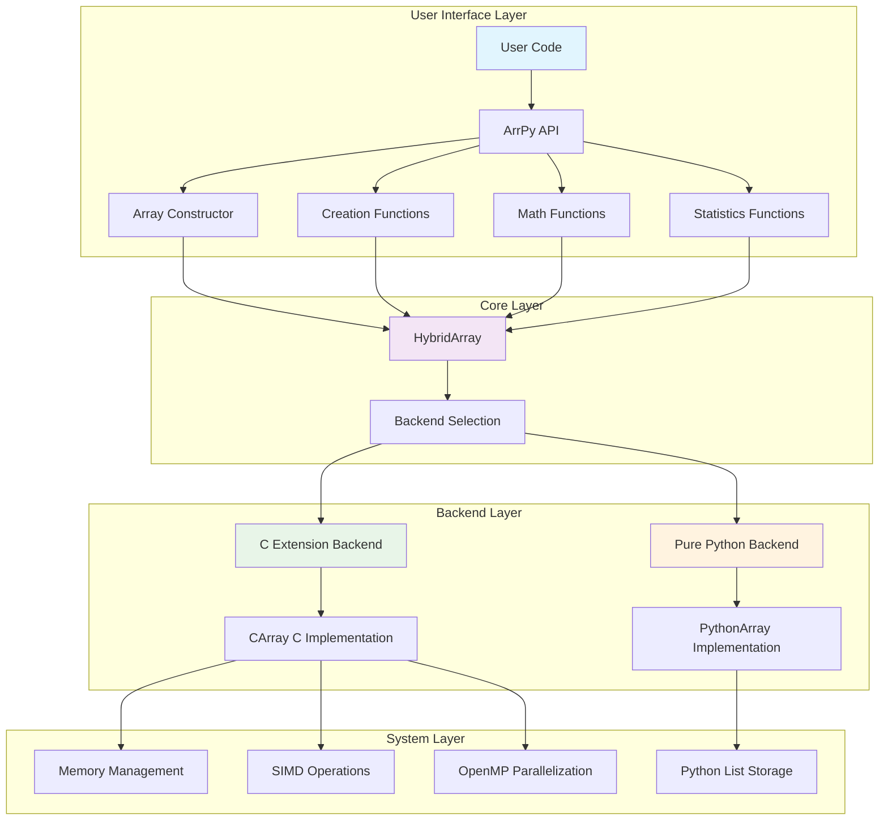

## 🔧 Core Components

### 1. HybridArray System

The heart of ArrPy is the hybrid array system that transparently selects between C and Python backends:

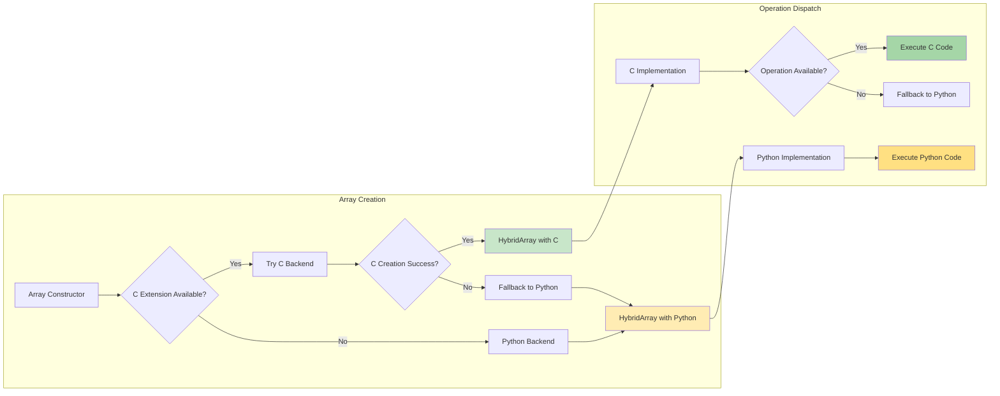

### 2. Memory Layout

ArrPy uses different memory strategies for optimal performance:

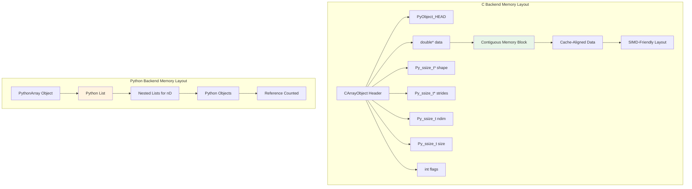

## 🚀 Backend Selection Logic

### Automatic Backend Selection

```python
class HybridArray:
    def __init__(self, data, _c_array=None):
        if _c_array is not None:
            # Direct C array provided
            self._c_array = _c_array
            self._use_c = True
        elif HAS_C_EXTENSION and isinstance(data, list):
            try:
                # Try C backend for list input
                self._c_array = CArray(data)
                self._use_c = True
            except Exception:
                # Fallback to Python
                self._python_array = PythonArray(data)
                self._use_c = False
        else:
            # Use Python backend
            self._python_array = PythonArray(data)
            self._use_c = False
```

### Performance Decision Tree

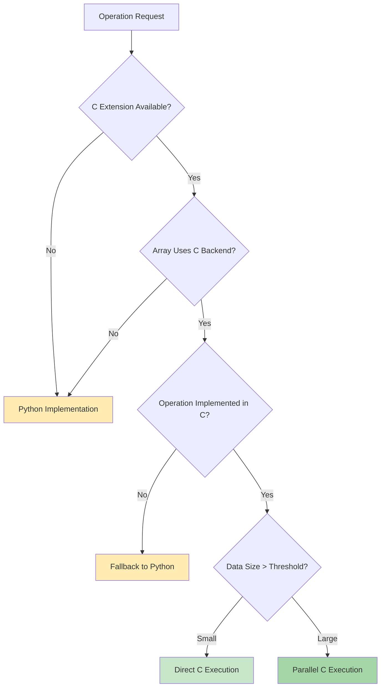

## 🔄 Data Flow Architecture

### Array Operations Pipeline

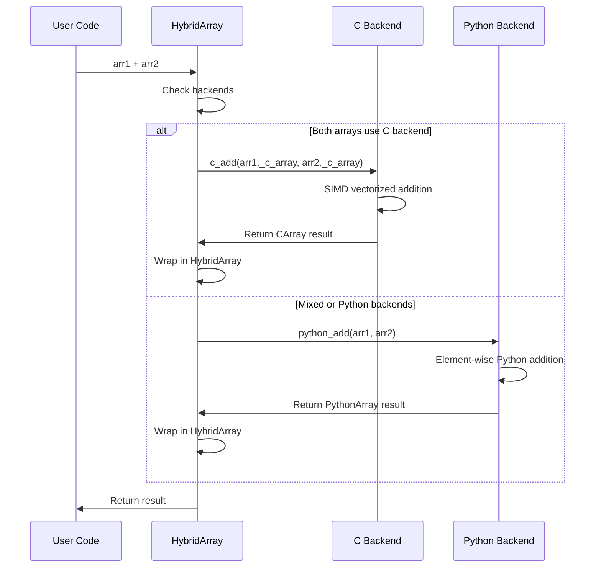

### Memory Management Flow

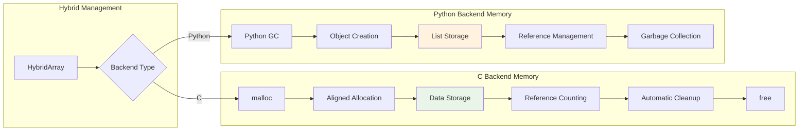

## 🏗️ Module Structure

### Directory Layout

```
arrpy/
├── __init__.py              # Main module exports
├── core/                    # Core functionality
│   ├── __init__.py         # Core exports
│   ├── array.py            # PythonArray implementation
│   ├── hybrid_array.py     # HybridArray wrapper
│   └── c_backend.py        # C extension interface
├── creation/               # Array creation functions
│   ├── __init__.py
│   └── basic.py           # zeros, ones, arange, etc.
├── math/                  # Mathematical functions
│   ├── __init__.py
│   ├── basic.py          # +, -, *, /
│   ├── trigonometric.py  # sin, cos, tan
│   ├── exponential.py    # exp, log, sqrt
│   └── rounding.py       # floor, ceil, round
├── statistics/           # Statistical functions
│   ├── __init__.py
│   ├── aggregation.py   # sum, mean, min, max
│   ├── variance.py      # std, var
│   └── advanced.py      # percentile, median
├── manipulation/        # Array manipulation
│   ├── __init__.py
│   ├── shape.py        # reshape, transpose
│   └── joining.py      # concatenate, stack
└── c_src/              # C extension source
    ├── c_array.h       # C array structure
    ├── c_array.c       # Core C implementation
    ├── c_math.c        # Mathematical operations
    ├── c_stats.c       # Statistical operations
    └── module.c        # Python module interface
```

### Import Resolution

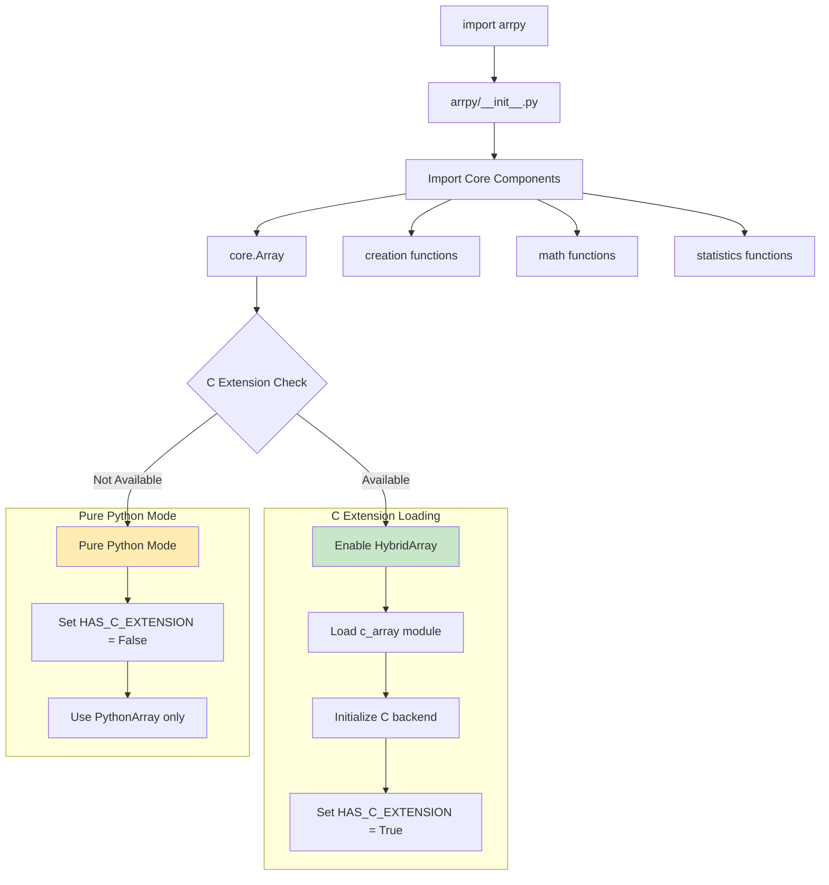

## ⚡ Performance Optimizations

### C Extension Optimizations

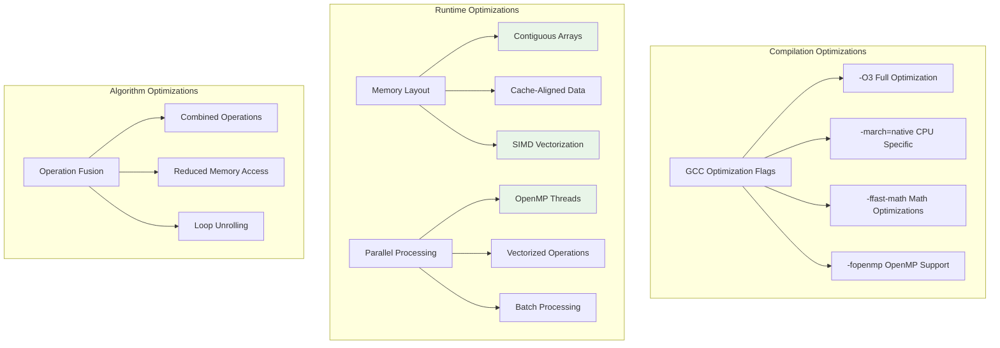

### Memory Optimization Strategies

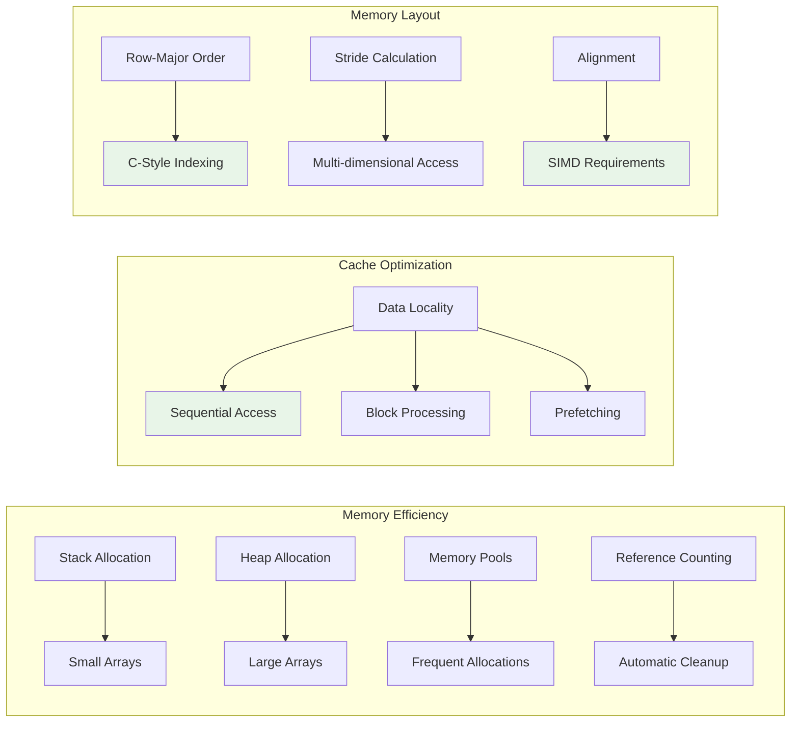

## 🔧 Extension Architecture

### C Extension Structure

```c
// Core C array structure
typedef struct {
    PyObject_HEAD
    double* data;           // Contiguous data storage
    Py_ssize_t* shape;      // Dimension sizes
    Py_ssize_t* strides;    // Memory strides
    Py_ssize_t ndim;        // Number of dimensions
    Py_ssize_t size;        // Total elements
    int flags;              // Array properties
} CArrayObject;
```

### Python-C Interface

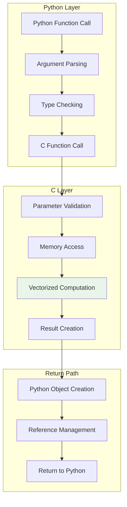

## 🔄 Error Handling Strategy

### Multi-Level Error Handling

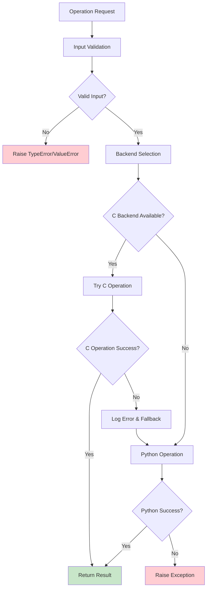

### Exception Hierarchy

```python
ArrPyError (Base Exception)
├── ShapeError (Shape incompatibility)
├── DimensionError (Dimension mismatch)
├── IndexError (Invalid indexing)
├── BackendError (C extension issues)
└── ComputationError (Mathematical errors)
```

## 📊 Testing Architecture

### Test Organization

**Test Structure:**
```
tests/
├── test_core/          # Core functionality tests
├── test_creation/      # Array creation tests
├── test_math/          # Mathematical operation tests
├── test_statistics/    # Statistical function tests
├── test_manipulation/  # Array manipulation tests
└── test_performance/   # Performance benchmark tests
```

**Test Types:**
- **Unit Tests** → Individual Functions
- **Integration Tests** → Component Interaction  
- **Performance Tests** → Benchmark Validation
- **Compatibility Tests** → Backend Consistency

**Test Execution Pipeline:**
```
pytest Runner → Automatic Discovery → Parallel Execution → Coverage Reporting
```

## 🚀 Build System

### Compilation Pipeline

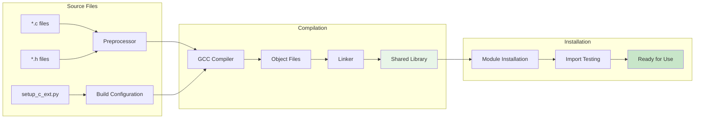

## 🔍 Debugging and Profiling

### Debug Information Flow

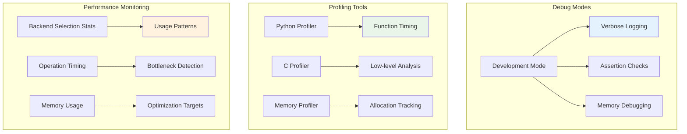

## 🔧 Configuration System

### Runtime Configuration

```python
# Configuration priorities (highest to lowest)
1. Function parameters
2. Environment variables
3. Configuration files
4. Default values

# Environment variables
ARRPY_USE_C_BACKEND=1     # Force C backend
ARRPY_DEBUG=1             # Enable debug mode
ARRPY_SIMD_THRESHOLD=1000 # SIMD activation threshold
ARRPY_THREADS=4           # OpenMP thread count
```

### Feature Detection

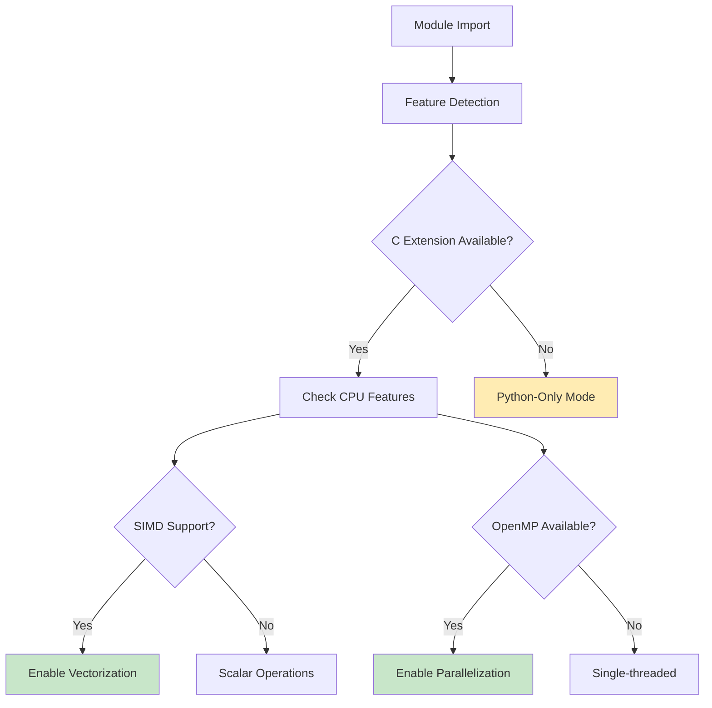

## 📈 Scalability Considerations

### Performance Scaling

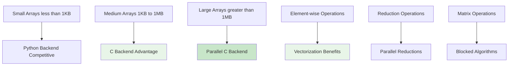

## 🔮 Future Architecture Plans

### Extensibility Points

1. **Plugin System**: Dynamic backend registration
2. **GPU Support**: CUDA/OpenCL backends
3. **Distributed Computing**: Multi-node arrays
4. **Memory Mapping**: Large dataset support
5. **Custom Data Types**: Beyond double precision

### Architecture Evolution

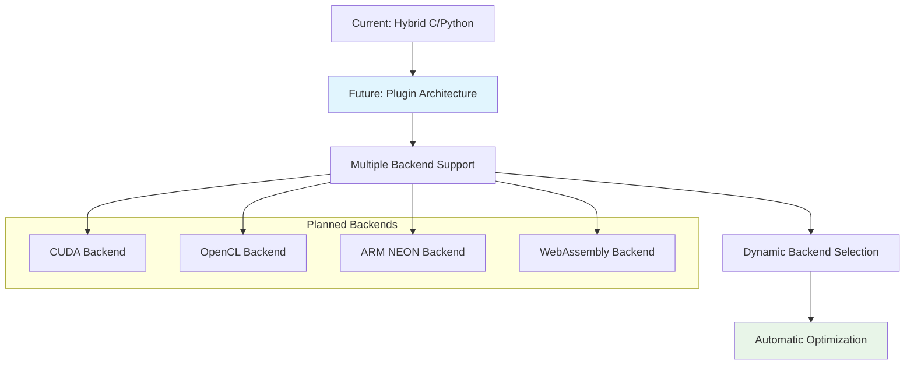

This architecture overview provides a comprehensive understanding of ArrPy's design, implementation, and future direction. The modular architecture ensures maintainability, extensibility, and optimal performance across different use cases.